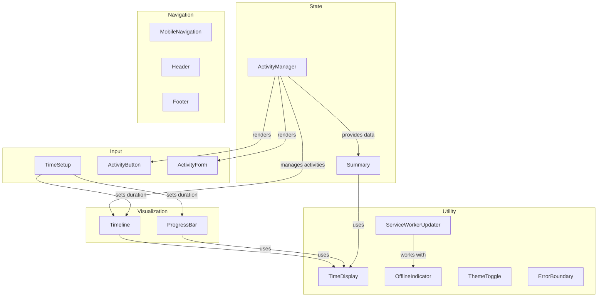

# Component Documentation

This directory contains comprehensive documentation for all key components in the application. Each component documentation includes props, state management approach, theme compatibility, mobile responsiveness, accessibility considerations, and examples.

## Visualization Components
- [**Timeline**](./Timeline.md): Visualizes activity entries along a time axis
- [**ProgressBar**](./ProgressBar.md): Displays current progress toward completion

## State Management Components  
- [**ActivityManager**](./ActivityManager.md): Manages activity selection and state
- [**Summary**](./Summary.md): Displays activity statistics and completion info

## User Input Components
- [**TimeSetup**](./TimeSetup.md): Controls for setting up duration
- [**ActivityButton**](./ActivityButton.md): Controls activity states in the application
  
## Navigation Components
- [**MobileNavigation**](./MobileNavigation.md): Touch-optimized navigation for mobile devices
- [**Header**](./Header.md): App header with branding and theme toggle
- [**Footer**](./Footer.md): App footer with primary actions

## Auxiliary Components
- [**ServiceWorkerUpdater**](./ServiceWorkerUpdater.md): Handles app updates
- [**ActivityForm**](./ActivityForm.md): Form for creating new activities
- [**OvertimeIndicator**](./OvertimeIndicator.md): Shows when user is in overtime

## Utility Components
- [**TimeDisplay**](./TimeDisplay.md): Formats and displays time values
- [**OfflineIndicator**](./OfflineIndicator.md): Shows offline status
- [**ThemeToggle**](./ThemeToggle.md): Controls theme selection
- [**ErrorBoundary**](./ErrorBoundary.md): Catches and handles component errors

## Component Relationships

### Component Interaction Summary

- **ActivityManager** is the central hub that manages activities displayed in Timeline
- **TimeSetup** configures the time duration used by both Timeline and ProgressBar
- **TimeDisplay** is used by multiple components for consistent time formatting
- **Timeline** and **ProgressBar** work together to visualize activity progress
- **Summary** provides statistics based on completed activities
- **ThemeToggle** affects the appearance of all components
- **ErrorBoundary** can wrap any component for error handling

## Component Legend

- **Visualization Components**: Timeline, ProgressBar
- **State Management Components**: ActivityManager, Summary  
- **User Input Components**: TimeSetup, ActivityButton
- **Navigation Components**: MobileNavigation, Header, Footer
- **Auxiliary Components**: ServiceWorkerUpdater, ActivityForm, OvertimeIndicator
- **Utility Components**: TimeDisplay, OfflineIndicator, ThemeToggle, ErrorBoundary

### Diagram Relationship Types

- **Solid lines**: Direct parent-child rendering relationships
- **Dashed lines**: Functional dependencies or interactions
- **Text on lines**: Describes the nature of the relationship

## Related Documentation

- [Main README](../../README.md)
- [Development Process Guidelines](../PLANNED_CHANGES.md#development-process-guidelines)
- [Memory Log](../MEMORY_LOG.md) - Project history and issue resolutions
