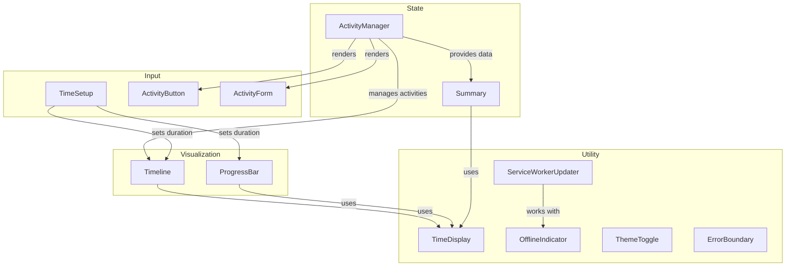

# Component Documentation

This directory contains comprehensive documentation for all key components in the application. Each component documentation includes props, state management approach, theme compatibility, mobile responsiveness, accessibility considerations, and examples.

## Visualization Components

These components handle the visual display of activities and time information:

- [**Timeline**](./Timeline.md): Visualizes activities and breaks on a vertical timeline
- [**ProgressBar**](./ProgressBar.md): Displays progress through visual color transitions

## State Management Components

These components handle the core application state and data presentation:

- [**ActivityManager**](./ActivityManager.md): Central hub for activity management
- [**Summary**](./Summary.md): Provides overview of completed activity session

## User Input Components

These components handle user interactions and input:

- [**TimeSetup**](./TimeSetup.md): Configures time settings for the application
- [**ActivityButton**](./ActivityButton.md): Controls activity states in the application

## Auxiliary Components

These components provide supporting functionality:

- [**ServiceWorkerUpdater**](./ServiceWorkerUpdater.md): Manages service worker lifecycle and update notifications
- [**ActivityForm**](./ActivityForm.md): Interface for creating and editing activities
- [**ConfirmationDialog**](./ConfirmationDialog.md): Modal dialog for confirming user actions (Bootstrap-based)
- [**ShareControls**](./ShareControls.md): Controls for copying/opening/downloading share links and replacing from shared data

## Utility Components

These components handle specific utility functions:

- [**TimeDisplay**](./TimeDisplay.md): Standardized time and date presentation
- [**OfflineIndicator**](./OfflineIndicator.md): Visual feedback for offline status
- [**ThemeToggle**](./ThemeToggle.md): Switches between light and dark themes
- [**ErrorBoundary**](./ErrorBoundary.md): Catches and handles JavaScript errors

## Component Relationships

### Component Interaction Summary

- **ActivityManager** is the central hub that manages activities displayed in Timeline
- **TimeSetup** configures the time duration used by both Timeline and ProgressBar
- **TimeDisplay** is used by multiple components for consistent time formatting
- **Timeline** and **ProgressBar** work together to visualize activity progress
- **Summary** provides statistics based on completed activities
- **ThemeToggle** affects the appearance of all components
- **ErrorBoundary** can wrap any component for error handling

## Component Legend

- **Visualization Components**: Timeline, ProgressBar
- **State Management Components**: ActivityManager, Summary  
- **User Input Components**: TimeSetup, ActivityButton
- **Auxiliary Components**: ServiceWorkerUpdater, ActivityForm, ConfirmationDialog
- **Utility Components**: TimeDisplay, OfflineIndicator, ThemeToggle, ErrorBoundary

### Diagram Relationship Types

- **Solid lines**: Direct parent-child rendering relationships
- **Dashed lines**: Functional dependencies or interactions
- **Text on lines**: Describes the nature of the relationship

## Related Documentation

- [Main README](../../README.md)
- [Planning Changes](../PLANNED_CHANGES.md) - How to document upcoming changes
- [Planning Template](../templates/PLANNED_CHANGES_TEMPLATE.md) - Template for new change requests
- [Memory Log](../MEMORY_LOG.md) - Project history and issue resolutions
