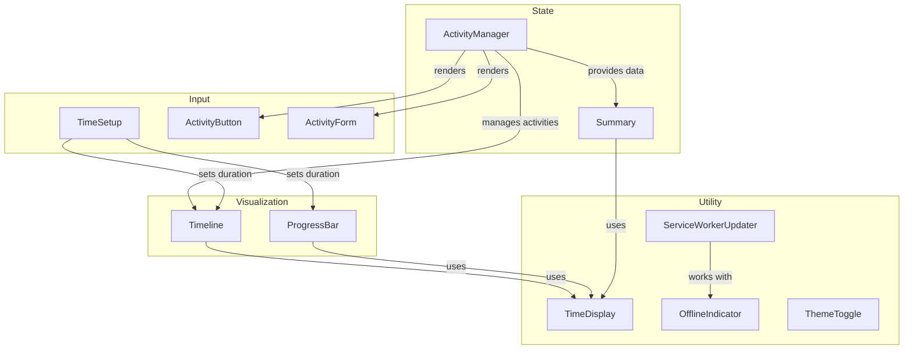

# Component Documentation

This directory contains documentation for the key components in the application.

## Visualization Components

- [**Timeline**](./Timeline.md) — Vertical timeline showing activities and breaks
- [**ProgressBar**](./ProgressBar.md) — Visual progress indicator with color transitions

## State Management Components

- [**ActivityManager**](./ActivityManager.md) — Central hub for activity lifecycle management
- [**Summary**](./Summary.md) — Session overview with statistics

## User Input Components

- [**TimeSetup**](./TimeSetup.md) — Session duration configuration
- [**ActivityButton**](./ActivityButton.md) — Activity state controls
- [**ActivityForm**](./ActivityForm.md) — Form for creating and editing activities

## Auxiliary Components

- [**ServiceWorkerUpdater**](./ServiceWorkerUpdater.md) — Service worker lifecycle and update notifications
- [**ConfirmationDialog**](./ConfirmationDialog.md) — Bootstrap-based confirmation modal
- [**ShareControls**](./ShareControls.md) — Session sharing controls (copy/open/download)

## Utility Components

- [**TimeDisplay**](./TimeDisplay.md) — Standardized time and date formatting
- [**OfflineIndicator**](./OfflineIndicator.md) — Network status indicator
- [**ThemeToggle**](./ThemeToggle.md) — Light/Dark/System theme switcher
- [**UpdateNotification**](./UpdateNotification.md) — App update notifications

## Additional Components (Undocumented)

The following components exist in the codebase but do not yet have dedicated documentation:

- **Navigation** / **BottomNavigation** — Desktop navbar and mobile bottom navigation
- **MobileTimeline** / **CollapsibleTimeline** — Mobile-optimized timeline variants
- **SwipeableActivityCard** — Touch-gesture activity cards
- **PWAInstallPrompt** — Progressive Web App install prompt
- **OvertimeWarning** — Session overtime notification
- **ApiKeyDialog** — BYOK API key entry dialog
- **MobileOptimizedInput** — Touch-friendly form input
- **ToastContainer** — Toast notification system

## Component Relationships

```mermaid
graph TD
    subgraph Visualization
        TL[Timeline]
        PB[ProgressBar]
    end
    
    subgraph State
        AM[ActivityManager]
        SUM[Summary]
    end
    
    subgraph Input
        TS[TimeSetup]
        AB[ActivityButton]
        AF[ActivityForm]
    end
    
    subgraph Utility
        TD[TimeDisplay]
        OI[OfflineIndicator]
        TT[ThemeToggle]
        SWU[ServiceWorkerUpdater]
    end
    
    AM --> |manages activities| TL
    TS --> |sets duration| TL
    TS --> |sets duration| PB
    AM --> |provides data| SUM
    TL --> |uses| TD
    PB --> |uses| TD
    SUM --> |uses| TD
    AM --> |renders| AB
    AM --> |renders| AF
    SWU --> |works with| OI
```

## Related Documentation

- [Main README](../../README.md)
- [Planned Changes](../PLANNED_CHANGES.md)
- [Full Documentation Index](../README.md)
